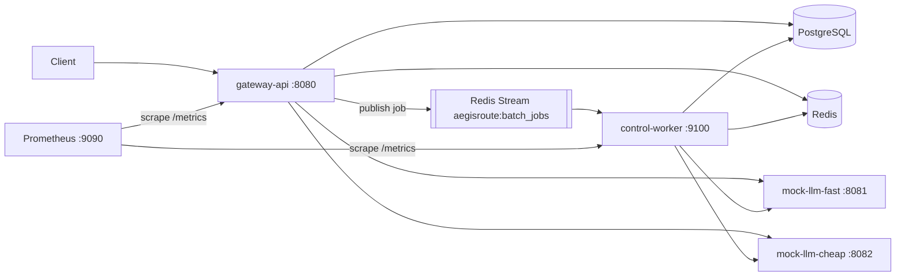

# AegisRoute — PROJECT_STATE

This file is the project's resumable memory. A new session resumes by reading
this file, `TODO.md`, `IMPLEMENTATION_LOG.md`, and `DECISIONS.md`, then running
`make verify`.

## Project goal

AegisRoute is a Go LLM inference gateway / control plane. It sits in front of
one or more OpenAI-compatible model backends and adds the boring-but-hard
backend concerns: auth, routing, retries, a circuit breaker, response caching,
idempotency, rate limiting, async batch processing, and metrics. Clients talk
to AegisRoute instead of talking to a model backend directly. **The value is
the control plane, not chatbot quality** — the model backends are deterministic
fakes on purpose.

## Architecture summary

`gateway-api` is the HTTP entry point (`:8080`): it authenticates requests,
routes inference to one of two `mock-llm` backends, and uses PostgreSQL for
durable state (API keys, backends, jobs) and Redis for cache / rate limits /
idempotency. Batch jobs are published to the Redis Stream
`aegisroute:batch_jobs` and consumed by `control-worker` (`:9100`), which
processes items with a bounded worker pool against the same backends and
stores. Prometheus scrapes `/metrics` on both processes.



**Exactly three binaries exist, forever:**

- `cmd/gateway-api` — the HTTP API server; `-migrate` runs DB migrations then
  exits, `-seed` inserts demo data then exits, default = serve.
- `cmd/control-worker` — reads batch jobs off a Redis Stream, bounded worker
  pool, own `/healthz` + `/metrics` port.
- `cmd/mock-llm` — fake OpenAI-compatible backend; two instances run in
  Compose ("fast" and "cheap").

## The 7 stages

1. **Foundations** (config, errors, logging, metrics scaffold) — ✅ **DONE** (`make verify` green)
2. **Data layer** (migrations, db, redisstore, models, repos) — ✅ **DONE**
3. **Gateway core** (server, middleware, auth, health/ready, seed, /v1/models) — ✅ **DONE**
4. **Sync inference** (mock-llm, inference client, routing, retry/timeout, circuit breaker, /v1/chat/completions) — ✅ **DONE**, committed (`c38a2a6` + polish `eed317c`)
5. **Cache + idempotency + rate limiting** — ✅ **DONE** (committed on branch)
6. **Batch jobs + Redis Streams + control-worker** — ✅ **DONE** (committed on branch)
7. **Docker/Compose/Prometheus/E2E/README/docs/CI** — ✅ **DONE** (implemented; **uncommitted** — see "Current state")

**PROJECT PHASE: COMPLETE.** All 7 stages implemented. Only `docs/future-work.md`
items remain intentionally unbuilt.

## Current state (2026-07-07) — Stage 7 DONE, MVP COMPLETE, uncommitted

All 7 stages are implemented. The Docker-free gate is green (`gofmt -l .`
empty, `go vet ./...`, `go build ./...`, `go test ./...`). **Deliberately
uncommitted** per instruction. Suggested final commit:

```
git commit -m "feat: docker compose, prometheus, e2e, docs, CI — MVP complete"
```

What shipped (Stage 7 — package/run/verify/document):

- **Dockerfiles** (`deploy/docker/{gateway-api,control-worker,mock-llm}.Dockerfile`)
  — multi-stage, pinned `golang:1.25.11` build stage, static CGO-free binaries
  (`CGO_ENABLED=0 -trimpath -ldflags="-s -w"`), final stage on
  `gcr.io/distroless/static-debian12:nonroot` (non-root, no `:latest`).
  `.dockerignore` trims the build context.
- **`docker-compose.yml`** — postgres (`pg_isready` healthcheck + `pgdata`
  named volume), redis (`redis-cli ping` healthcheck), gateway-api (`:8080`,
  `depends_on` healthy PG/Redis, `AEGISROUTE_AUTO_MIGRATE`/`AUTO_SEED=true`,
  service-name `DATABASE_URL`/`REDIS_ADDR`, seed backend URLs),
  control-worker (`:9100`, `ValidateForWorker` so it needs only DB+Redis),
  mock-llm-fast (`:8081`) + mock-llm-cheap (`:8082`) both `MOCK_MODEL_NAME=llama-fast`,
  prometheus (`:9090`). Service-name networking, no platform pins.
- **`observability/prometheus.yml`** — scrapes `gateway-api:8080` and
  `control-worker:9100`.
- **`scripts/e2e.sh`** — `set -euo pipefail`; preflight for docker/curl/jq/go;
  cleanup trap (`docker compose down -v --remove-orphans`); clean-slate start;
  gofmt/vet/test gate; `up -d --build`; **bounded** readiness waits
  (30×2s = 60s cap) for `/readyz` + `/healthz`; chat MISS then HIT (distinct
  idempotency keys); batch create → **bounded** terminal poll (30×2s) → both
  items terminal; gateway + worker `aegisroute_*` metrics; live
  `go test -tags=integration ./...` with the host-side env exported. Every
  wait is time-bounded.
- **Makefile** — real `dev-up` (`up -d --build`), `dev-down`
  (`down -v --remove-orphans`), `logs` (`logs -f`), `verify-e2e`
  (`bash scripts/e2e.sh`).
- **`.github/workflows/ci.yml`** — `unit` (gofmt/vet/test, Docker-free) +
  `integration` (postgres+redis service containers → `-migrate` →
  `go test -tags=integration ./...`), Go 1.25, module cache.
- **`README.md`** — full: overview, not-a-chatbot, not-a-thin-proxy, mermaid
  diagram, quickstart, LOCAL-ONLY creds, curl + cache-HIT + batch + metrics
  demos, Developer Operations, Assumptions & Tradeoffs, failure modes.
- **`docs/`** — architecture.md, api.md, failure-modes.md, resume-bullets.md,
  future-work.md (non-MVP items only; `XAUTOCLAIM` is NOT listed as future work
  — it's already used).

**`make verify-e2e` live-run status: PASSED (2026-07-07, Docker 29.6.1 /
Compose v2).** Ran the full script end to end: all five pinned base images
pull (`golang:1.25.11`, `gcr.io/distroless/static-debian12:nonroot`,
`prom/prometheus:v3.1.0`, `postgres:17-alpine`, `redis:7-alpine`); postgres +
redis reach healthy; gateway `/readyz` and worker `/healthz` up on attempt 1;
sync chat #1 → `X-AegisRoute-Cache: MISS`, #2 (new key, same body) → `HIT`;
batch job reached `succeeded` with both items terminal; both processes export
`aegisroute_*`; live `go test -tags=integration ./...` all PASS; cleanup trap
tore the stack down (verified no leftover containers). The Docker-free gate
(`gofmt`/`vet`/`build`/`test`) is also green.

## Prior state (2026-07-07) — Stage 6 DONE (committed `e65a64b`)

What shipped (Stage 6):

- **`internal/redisstore` queue** — `Queue` interface
  (`Publish`/`Consume`/`Ack`/`Claim`/`PublishDLQ`) + `Message{ID,JobID}`.
  Redis Streams adapter (`queue.go`): `XADD` publish; consumer group created
  with `MKSTREAM` at offset **0** (so a worker booted after the API already
  published still drains the backlog); `XREADGROUP` per-instance consumer
  that **never auto-acks**; `XACK` in `Ack`; `XAUTOCLAIM` in `Claim`; `XADD`
  to `<stream>:dlq` in `PublishDLQ`. In-memory `MemQueue` fake (`memqueue.go`)
  mirrors the at-least-once contract (delivery → in-flight set, Ack the only
  exit, handler error leaves it recoverable, `Claim` by idle age) with
  publish-error injection and DLQ/ack/inflight/pending introspection for tests.
- **`internal/jobs`** — pure status machines (`status.go`:
  `ValidJobTransition`, `ValidItemTransition`, `AggregateJobStatus`), the
  `JobStore` interface + claim result types (`store.go`), and the in-memory
  `MemStore` (`memstore.go`). `jobs.ErrNotFound` is the store's absence
  sentinel (db imports jobs for the claim types, mirroring db←idempotency).
- **`internal/db/job_repo.go`** — `JobRepo`: `CreateWithItemsAndOutbox` in one
  transaction (job=queued + N items=queued + one pending outbox row);
  `ClaimNextQueuedItem` atomic via `FOR UPDATE SKIP LOCKED` with claim-time
  exhaustion (attempts+1 > max → item durably failed, `ClaimExhausted`);
  `UpdateItemTerminal` guarded by `WHERE status='running'` (terminal items
  immutable → redelivery-safe); `RecomputeAndUpdateJobStatus` derives status
  in SQL mirroring `AggregateJobStatus`; `RequeueRunningItems` for crash
  recovery; outbox drain/publish/fail marks; all reads tenant-scoped.
- **`internal/api` batch handlers** (`batch.go`) — `POST /api/v1/batch-jobs`
  (10 MiB cap; MVP schema `{requests:[{custom_id,body}]}`; reuses the Stage-4
  chat validation per item body; 1..100 items; unique non-empty custom_id;
  same-model rule stored in `batch_jobs.model`; **Stage-5 idempotency
  precedence** — Check → rate limit → Begin → work → Complete/Release;
  transactional create then **exactly one** job-level publish; publish failure
  marks the outbox failed-attempt and leaves it pending, never orphaning the
  job). `GET` list/get/items **all tenant-filtered** (cross-tenant read = 404).
  New Deps interfaces `BatchJobStore` + `JobPublisher`; wired into the bearer
  group (GETs take the shared per-key rate budget via middleware, create checks
  it inline like chat).
- **`internal/worker`** (`worker.go`) — `Worker` consumes job messages: set
  job running → **bounded pool** (semaphore = `WORKER_CONCURRENCY`) each
  goroutine repeatedly `ClaimNextQueuedItem` → shared `internal/routing` +
  `internal/inference` (with intra-item failover; **never HTTP to
  gateway-api**) → durable terminal write → after all items terminal,
  `RecomputeAndUpdateJobStatus` → **only then `Ack`**. Redelivery-safe
  (terminal items unclaimable). `RequeueRunningItems` recovers items a crashed
  worker left running. Exhaustion (`WORKER_MAX_ITEM_ATTEMPTS`) → exactly one
  DLQ entry per item, keep processing the rest. Periodic `Claim` (XAUTOCLAIM)
  reclaim loop + periodic outbox-drain loop (`PendingOutbox` → `Publish` →
  `MarkOutboxPublished`, mark published only after publish succeeds). Pool
  goroutines are panic-safe (no ack → redelivery).
- **`cmd/control-worker/main.go`** — config → logger → pgx pool → redis →
  metrics → shared breaker/selector/inference/queue/store/worker →
  `worker.Run` (consume + reclaim + outbox tickers) + `/healthz` + `/metrics`
  on `WORKER_METRICS_PORT` → graceful shutdown on SIGINT/SIGTERM.
- **Metrics** — `BatchJobsCreatedTotal` (create), `BatchItemsProcessedTotal
  {outcome}` (worker per-item), `WorkerFailuresTotal` (worker-level failures,
  not per-item business failures).

Stage-6 tests (all Docker-free): pure status machine (every transition + all
three aggregations); MemStore (tenant scoping, concurrent claims never
duplicate, exhaustion, terminal immutability, aggregation, outbox lifecycle);
queue adapter over **miniredis** (publish→consume→ack; Consume-no-auto-ack +
`Claim` recovers a stranded pending message using `mr.SetTime` — note
`FastForward` does NOT age stream PEL entries, only TTLs; DLQ stream; backlog
published before the group existed); MemQueue fake; **worker pool** (white-box:
concurrency peak ≤ limit via atomic counter, redelivery skips terminal items,
**Ack strictly after the durable store update** via instrumented recording
wrappers, exhausted item → DLQ + job failed, partial-failure aggregation,
outbox-drain retries then marks published only after publish succeeds); batch
endpoints (create persists job+items+one outbox row + exactly one publish;
publish failure keeps outbox pending; GET/items/list; idempotency-key replay
returns same job id and doesn't re-create or re-publish; cross-tenant GET/items
= 404; validation matrix). `internal/db/integration_test.go` gains `JobRepo`
and `JobRepoClaimExhaustion` subtests (`//go:build integration`; `stage2Tables`
already lists the batch tables).

### Post-Stage-6 verification pass (2 end-to-end runs) — 4 fixes (uncommitted, DoD green under -race)

Two full dataflow verifications (sync chat path + async batch path) surfaced
and fixed four issues; no unusable-level (build/tests/demo path were already
green), but two were Major worker-durability bugs:

1. **MAJOR — poison message on a vanished job:** a valid-UUID message whose job
   was deleted (its tenant removed, cascading) reached
   `RecomputeAndUpdateJobStatus` → `jobs.ErrNotFound` → `failJobPass` → never
   acked, so the reclaim loop redelivered it **forever**, spamming
   `WorkerFailuresTotal` and DB queries every tick. Fix: `handleMessage` now
   treats `jobs.ErrNotFound` from `MarkJobRunning`/`RecomputeAndUpdateJobStatus`
   as terminal — `dropMissingJob` dead-letters and acks the moot message
   (`internal/worker/worker.go`).
2. **MAJOR — reclaim self-race → premature exhaustion:** for a job whose single
   delivery ran longer than `ReclaimMinIdle` (60s), the same process's reclaim
   loop `XAUTOCLAIM`ed the still-in-flight message and ran a second concurrent
   pass; its `RequeueRunningItems` bounced items the consume loop was actively
   processing back to `queued`, and with a small `WORKER_MAX_ITEM_ATTEMPTS`
   the re-claim could **exhaust (DLQ) an item that was actually succeeding**.
   Fix: the worker tracks in-flight delivery IDs (`markInFlight`/`isInFlight`);
   `reclaimOnce` skips deliveries this process is already handling, and
   `handleMessage` has an in-flight backstop that no-ops a double entry.
3. **OTHER — unbounded Redis stream growth:** `XACK` removes an entry from the
   group's pending list but not from the stream, so `XADD` without trimming
   grew `aegisroute:batch_jobs` (and `:dlq`) without bound. Fix: approximate
   `MAXLEN ~100000` on both `XADD`s (`internal/redisstore/queue.go`).
4. **OTHER — worker required gateway-only config:** `control-worker` called
   `ValidateForServe`, which demands `ADMIN_TOKEN`, `APP_KEY_HASH_SECRET`,
   `APP_PORT`, `RATE_LIMIT_QPS`, `CACHE_TTL_SECONDS`, `IDEMPOTENCY_TTL_SECONDS`
   the worker never uses. Fix: new `config.ValidateForWorker()` checks only the
   stores, backend/retry/CB tuning, stream identity, and worker settings;
   `cmd/control-worker` uses it.

Also **closed a coverage gap**: added `TestWorker_EndToEndOverStreamQueue` —
`worker.Run` driving the real Redis-Streams consume loop over miniredis
(publish → consume → process → ack), which the unit tests (direct
`handleMessage`) had not exercised. New tests: worker missing-job-drop,
in-flight guard, the E2E path, and `ValidateForWorker`.

Verified-correct (no change needed): the exhaustion math (`WORKER_MAX_ITEM_ATTEMPTS=N`
→ N processing attempts then DLQ, no off-by-one); idempotent redelivery never
double-counts `BatchItemsProcessedTotal` (terminal items unclaimable, terminal
write guarded); the per-process circuit breaker is correctly shared by the
worker's selector and outcome reports; a transient failure that exhausts
failover is a terminal item result by design (cross-delivery retry via
`WORKER_MAX_ITEM_ATTEMPTS` is for crash recovery, not backend blips).

Files touched by the fixes: `internal/worker/worker.go` (+ `worker_test.go`),
`internal/redisstore/queue.go`, `internal/config/config.go` (+ `config_test.go`),
`cmd/control-worker/main.go`.

### Stage-6 design notes / non-obvious decisions

- **`jobs.ErrNotFound` (not `db.ErrNotFound`)** is the JobStore absence
  sentinel: `db` imports `jobs` for `ClaimResult`/`ClaimOutcome`, so the
  sentinel lives in `jobs`; `job_repo.go`'s `mapJobsNotFound` converts
  driver no-rows to it. Handlers and the worker test `errors.Is(err,
  jobs.ErrNotFound)`.
- **Consumer group at offset 0 + `ensureGroup` only on Consume/Claim** (not
  Publish) — the API publishes before any worker may exist; the group must
  replay from the beginning, not `$`.
- **`RequeueRunningItems` is necessary, not cosmetic:** without it, an item a
  crashed worker left `running` is never re-selected (claims only pick
  `queued`) and the job would never terminate → the message would redeliver
  forever. Concurrent duplicate deliveries (only via reclaim after 60s idle)
  can double-process an item, but that is idempotent (terminal items
  immutable, no double count) and bounded — acceptable per the "no distributed
  coordination beyond Postgres claims" non-goal.
- **Ack ordering is the at-least-once contract** and is asserted directly with
  instrumented store/queue wrappers recording call order.
- Did **not** add `prometheus/testutil` for a counter assertion (it pulls a
  new transitive module `kylelemons/godebug`); kept the locked dependency set.

## Prior state (2026-07-06) — Stage 5 DONE

Stage 5 is fully implemented and the Definition of Done is green
(`gofmt -l .` empty; `go vet ./...`, `go build ./...`, `go test ./...` all
pass Docker-free, also under `-race`), **deliberately uncommitted** per
instruction. Commit with:

```
git commit -m "feat: response cache, idempotency, rate limiting on completion path"
```

What shipped:

- `internal/cache` — eligibility (stream:false + effective temperature ≤ 0.2,
  omitted → OpenAI default 1.0, explicit 0 cacheable), canonical body
  (sorted keys, array order preserved), key = sha256(tenant/key scope ‖
  canonical body), Redis entries (body + content type) with
  CACHE_TTL_SECONDS; miniredis tests.
- `internal/idempotency` — `Classify` (single semantics source),
  `IdempotencyStore` (Lookup/Begin/Complete), `Coordinator`
  (Check → rate limit → Begin → Complete), `Scope` (tenant+key+method+route,
  reused by Stage 6); in-memory-fake tests.
- `internal/db/idempotency_repo.go` — Postgres-authoritative store; atomic
  INSERT … ON CONFLICT … WHERE reclaim of expired/stale-pending rows (DB
  clock); integration subtest covers insert/conflict/reclaim/complete/expiry.
- `internal/ratelimit` — Redis fixed-window per API key; INCR+PEXPIRE in one
  Lua invocation (an orphaned counter without expiry is impossible);
  miniredis + FastForward tests. Fail-open on Redis errors.
- `internal/api` — chat handler reworked to the exact precedence (raw body
  read once → raw-bytes hash → validate → idempotency Check → rate limit →
  Begin → cache lookup → route/inference → cache store → ledger → Complete
  on every path); `X-AegisRoute-Cache: HIT|MISS|BYPASS`; rate-limit
  middleware on `GET /v1/models` (shared per-key budget, chat checks
  inline); replay never reuses a stored X-Request-ID. Ledger rows now carry
  `cache_result`; HIT rows have `backend_id` NULL.
- `cmd/gateway-api` wiring (idempotency lock TTL = 2× ServerWriteTimeout);
  `docs/design-decisions.md` (required precedence note + fail-open/closed
  stances).

Stage-5 tests: 14 handler-integration tests (miniredis + real
cache/limiter/coordinator over an in-memory store), plus package tests for
cache/idempotency/ratelimit and the db integration subtest.

**Post-Stage-5 verification pass (2 rounds) found and fixed 3 issues (all
uncommitted, DoD still green under -race):**

1. **CRITICAL — idempotency reclaim id (data-integrity):** the Postgres
   `Begin` used `ON CONFLICT DO UPDATE` which KEEPS the original PK id, but
   the in-memory fakes and the integration test assume a reclaim mints a
   FRESH id. Consequences: (a) the integration test would FAIL on real
   Postgres, and (b) a crashed/lapsed owner's `Complete(oldID)` could
   overwrite the reclaimer's in-flight record with a stale response. Fixed by
   adding `id = gen_random_uuid()` to the reclaim `SET`, so the old owner's
   `Complete`/`Release` safely no-op.
2. **CRITICAL — transient errors were cached under the idempotency key:** a
   5xx (e.g. a momentary all-backends-down 503) was stored and replayed for
   the whole TTL (24h default), so a client correctly reusing its
   Idempotency-Key on retry was locked out even after the gateway recovered.
   Fixed: added `Release` to the store/coordinator/gate; `respondChat` now
   Completes only `< 500` (success + deterministic 4xx) and Releases `>= 500`
   so the retry is a fresh attempt.
3. **Hardening — unbounded Idempotency-Key:** capped at 255 chars, rejected
   with 400 before any store interaction (it is part of a unique index).

Files touched by the fixes: internal/db/idempotency_repo.go,
internal/idempotency/idempotency.go (+ _test), internal/api/chat.go +
router.go (+ chat_stage5_test, helpers_test), internal/db/integration_test.go,
DECISIONS.md, docs/design-decisions.md.

## Stage 4 state (2026-07-05)

Stage 4 is fully implemented, committed as `c38a2a6` ("feat: mock-llm,
inference client, routing, circuit breaker, chat completions"), and the
Definition of Done is green (`gofmt -l .` empty; `go vet ./...`,
`go build ./...`, `go test ./...` all pass, Docker-free). That commit
includes an adversarial-review hardening pass folded in before commit:

- caller-context cancellation is classified as "canceled", never as a
  transient backend failure (circuit breaker + metrics no longer poisoned by
  client disconnects); `Breaker.ReportCanceled` returns a reserved half-open
  probe slot;
- chat validation is case-SENSITIVELY strict (stdlib JSON tag matching would
  otherwise have accepted `"MODEL"`/`"Stream"`/`"Role"` aliases);
- the inference_requests ledger insert runs on a context detached from the
  request's cancellation, so disconnects can't erase audit rows;
- `backoff()` honors a zero base.

A later session added AI-assistant context docs (no source changes):
`CLAUDE.md` (root), `docs/REPO_MAP.md`, `docs/STAGE_STATUS.md`,
`internal/db/CLAUDE.md`, `internal/routing/CLAUDE.md`,
`internal/jobs/CLAUDE.md` (the requested "queue" rules — there is no
`internal/queue` package; the `Queue` interface is documented to live in
`internal/jobs`, see that file's naming note).

**Uncommitted Stage-4 polish (this session — NOT committed, per instruction):**
six gateway-hardening items on top of `c38a2a6`, DoD green under `-race`
(254 test cases, up from 144). All are documented in DECISIONS.md's Stage-4
section; suggested commit message: `feat: intra-request failover, async
ledger, response cap, panic-safe circuit, timeout-budget validation`.

1. **Intra-request failover** — the handler now re-selects (excluding tried
   backends via `Selector.Select(ctx, model, exclude...)`) and calls the next
   healthy backend on a transient failure, instead of 503-ing until the
   circuit trips. Permanent errors/cancellations don't fail over.
2. **Async ledger** (`internal/api/ledger.go`, `AsyncLedger`) — the
   inference_requests write moved off the hot path onto a bounded worker pool
   fed by a buffered queue; wired in `cmd/gateway-api` and closed-before-pool
   on shutdown. `Deps.Requests` → `Deps.Ledger` (`LedgerRecorder`).
3. **Response size cap** — `inference.Config.MaxResponseBytes` (default 10 MiB
   via `io.LimitReader`); oversized reply → permanent error, no OOM.
4. **Panic-safe circuit report** — `callBackend` defers `release()` and a
   fallback `ReportCanceled`, so a panic can't strand a half-open probe.
5. **Timeout-budget validation** — `config.ServerWriteTimeout` (shared by the
   http.Server and `ValidateForServe`) + `config.InferenceBudget()`; the
   handler bounds all failover attempts by that budget.
6. **Permanent e2e wiring test** (`internal/api/e2e_test.go`) — real
   Selector+Client+Breaker vs httptest backends (happy path, intra-request
   failover, circuit-opens-and-sheds).

**Branch note:** work lives on `stage4_sync_inference_v2`, cut from
`stage3_gateway_core` (60fca48). The older `stage4_Sync_inference` branch was
mistakenly cut from the Stage-2 lineage and contains no Stage-3 code — do not
resume there; its tree is byte-identical to the Stage-2 commit inside
stage3's history, so it can be deleted.

## Scope table

| Bucket | Contents |
| --- | --- |
| **Current stage (build now)** | Stages 1–6 COMPLETE (Stage 6 uncommitted). Next session builds Stage 7 only: Dockerfiles + docker-compose (postgres, redis, both mock-llms, gateway, worker, prometheus), Prometheus scrape config, `make dev-up/dev-down/logs/verify-e2e`, E2E script, GitHub Actions CI, full README + docs/future-work.md, final verification. |
| **Future milestones (roadmap only)** | None after Stage 7 (final stage). Do not create Stage-7 assets before starting Stage 7. |
| **Context only (never a build order)** | Architecture diagram, locked stack, ports table, demo credentials, Docker/compose notes, resume-positioning language. |
| **Non-goals (entire MVP; mention only in docs/future-work.md)** | k6, Grafana dashboards, Kubernetes, Terraform, real model providers, OIDC, RBAC, SSE/streaming, gRPC, sqlc, global/distributed concurrency control. |

## Locked stack

Go 1.25 (`go.mod` directive; toolchain may be newer). Module
`github.com/example/aegisroute`. chi/v5 (router), pgx/v5 + pgxpool (raw SQL, no
ORM), go-redis/v9, pressly/goose/v3 (embedded migrations), prometheus
client_golang, google/uuid, stretchr/testify, alicebob/miniredis/v2.
Hand-rolled `internal/config` (stdlib `os` only). `log/slog` JSON logging.
Full rationale in `DECISIONS.md`.

**Testing rule (every stage):** `go test ./...` passes with no Docker, no
Postgres, no Redis — interface-first design, in-memory fakes, miniredis.
Real-infra tests are `//go:build integration` only (`make test-integration`).

## Standard ports

```
gateway-api        :8080   (HTTP + /metrics)
control-worker     :9100   (/healthz + /metrics)
mock-llm-fast      :8081   (model: llama-fast, priority 10)
mock-llm-cheap     :8082   (model: llama-fast, priority 20)
postgres           :5432
redis              :6379
prometheus         :9090
```

## How to resume

1. Read `CLAUDE.md` (entry point), then this file, `TODO.md`,
   `IMPLEMENTATION_LOG.md`, `DECISIONS.md`. For structure, see
   `docs/REPO_MAP.md` and `docs/STAGE_STATUS.md`.
2. Run `make verify` (must be green before starting new work).
3. Work on the first unchecked stage in `TODO.md` — and only that stage.
   Check for a package-local `CLAUDE.md` (e.g. `internal/db/CLAUDE.md`)
   before touching that package.
4. Before stopping: update this file's stage status, tick `TODO.md`, append
   `IMPLEMENTATION_LOG.md`, and record any failing command + error verbatim.
