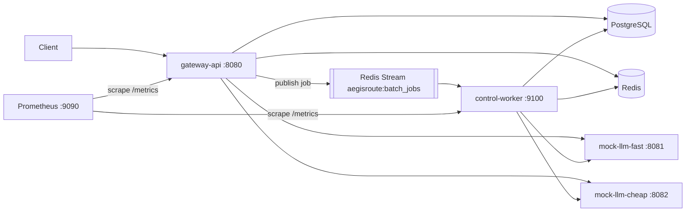

# AegisRoute — PROJECT_STATE

This file is the project's resumable memory. A new session resumes by reading
this file, `TODO.md`, `IMPLEMENTATION_LOG.md`, and `DECISIONS.md`, then running
`make verify`.

## Project goal

AegisRoute is a Go LLM inference gateway / control plane. It sits in front of
one or more OpenAI-compatible model backends and adds the boring-but-hard
backend concerns: auth, routing, retries, a circuit breaker, response caching,
idempotency, rate limiting, async batch processing, and metrics. Clients talk
to AegisRoute instead of talking to a model backend directly. **The value is
the control plane, not chatbot quality** — the model backends are deterministic
fakes on purpose.

## Architecture summary

`gateway-api` is the HTTP entry point (`:8080`): it authenticates requests,
routes inference to one of two `mock-llm` backends, and uses PostgreSQL for
durable state (API keys, backends, jobs) and Redis for cache / rate limits /
idempotency. Batch jobs are published to the Redis Stream
`aegisroute:batch_jobs` and consumed by `control-worker` (`:9100`), which
processes items with a bounded worker pool against the same backends and
stores. Prometheus scrapes `/metrics` on both processes.



**Exactly three binaries exist, forever:**

- `cmd/gateway-api` — the HTTP API server; `-migrate` runs DB migrations then
  exits, `-seed` inserts demo data then exits, default = serve.
- `cmd/control-worker` — reads batch jobs off a Redis Stream, bounded worker
  pool, own `/healthz` + `/metrics` port.
- `cmd/mock-llm` — fake OpenAI-compatible backend; two instances run in
  Compose ("fast" and "cheap").

## The 7 stages

1. **Foundations** (config, errors, logging, metrics scaffold) — ✅ **DONE** (`make verify` green)
2. **Data layer** (migrations, db, redisstore, models, repos) — ✅ **DONE**
3. **Gateway core** (server, middleware, auth, health/ready, seed, /v1/models) — ✅ **DONE**
4. **Sync inference** (mock-llm, inference client, routing, retry/timeout, circuit breaker, /v1/chat/completions) — ✅ **DONE** (implemented + DoD green; **uncommitted** — see "Current state" below)
5. Cache + idempotency + rate limiting ← **NEXT**
6. Batch jobs + Redis Streams + control-worker
7. Docker/Compose/Prometheus/E2E/README/docs/CI + final verification

## Current state (2026-07-05)

Stage 4 is fully implemented and the Definition of Done is green
(`gofmt -l .` empty; `go vet ./...`, `go build ./...`, `go test ./...` all
pass, Docker-free). The base implementation is committed as `f833d0e`
("stage 4 implemented"). An adversarial review pass then produced
**uncommitted hardening fixes** in the working tree (all verified green):

- caller-context cancellation is classified as "canceled", never as a
  transient backend failure (circuit breaker + metrics no longer poisoned by
  client disconnects); `Breaker.ReportCanceled` returns a reserved half-open
  probe slot;
- chat validation is case-SENSITIVELY strict (stdlib JSON tag matching would
  have accepted `"MODEL"`/`"Stream"`/`"Role"` aliases);
- the inference_requests ledger insert runs on a context detached from the
  request's cancellation, so disconnects can't erase audit rows;
- `backoff()` honors a zero base; removed a review agent's stray
  `zz_scratch_review_test.go` that `f833d0e` accidentally picked up.

Since the branch is unpushed, fold the fixes into the stage commit:

```
git add -A && git commit --amend -m "feat: mock-llm, inference client, routing, circuit breaker, chat completions"
```

(or keep `f833d0e` and add a second commit, e.g. `fix: cancellation vs
circuit breaker, case-sensitive chat validation, detached audit writes`).

**Branch note:** work lives on `stage4_sync_inference_v2`, cut from
`stage3_gateway_core` (60fca48). The older `stage4_Sync_inference` branch was
mistakenly cut from the Stage-2 lineage and contains no Stage-3 code — do not
resume there; its tree is byte-identical to the Stage-2 commit inside
stage3's history, so it can be deleted.

## Scope table

| Bucket | Contents |
| --- | --- |
| **Current stage (build now)** | Stages 1–4 COMPLETE (Stage 4 uncommitted). Next session builds Stage 5 only: internal/cache, internal/idempotency, internal/ratelimit, miniredis-backed tests, X-AegisRoute-Cache header. |
| **Future milestones (roadmap only)** | Stages 6–7. Do not create their source files, Docker assets, CI, scripts, or README sections early. Future-stage Makefile targets fail with `not implemented until Stage X`. |
| **Context only (never a build order)** | Architecture diagram, locked stack, ports table, demo credentials, Docker/compose notes, resume-positioning language. |
| **Non-goals (entire MVP; mention only in docs/future-work.md)** | k6, Grafana dashboards, Kubernetes, Terraform, real model providers, OIDC, RBAC, SSE/streaming, gRPC, sqlc, global/distributed concurrency control. |

## Locked stack

Go 1.25 (`go.mod` directive; toolchain may be newer). Module
`github.com/example/aegisroute`. chi/v5 (router), pgx/v5 + pgxpool (raw SQL, no
ORM), go-redis/v9, pressly/goose/v3 (embedded migrations), prometheus
client_golang, google/uuid, stretchr/testify, alicebob/miniredis/v2.
Hand-rolled `internal/config` (stdlib `os` only). `log/slog` JSON logging.
Full rationale in `DECISIONS.md`.

**Testing rule (every stage):** `go test ./...` passes with no Docker, no
Postgres, no Redis — interface-first design, in-memory fakes, miniredis.
Real-infra tests are `//go:build integration` only (`make test-integration`).

## Standard ports

```
gateway-api        :8080   (HTTP + /metrics)
control-worker     :9100   (/healthz + /metrics)
mock-llm-fast      :8081   (model: llama-fast, priority 10)
mock-llm-cheap     :8082   (model: llama-fast, priority 20)
postgres           :5432
redis              :6379
prometheus         :9090
```

## How to resume

1. Read this file, `TODO.md`, `IMPLEMENTATION_LOG.md`, `DECISIONS.md`.
2. Run `make verify` (must be green before starting new work).
3. Work on the first unchecked stage in `TODO.md` — and only that stage.
4. Before stopping: update this file's stage status, tick `TODO.md`, append
   `IMPLEMENTATION_LOG.md`, and record any failing command + error verbatim.
