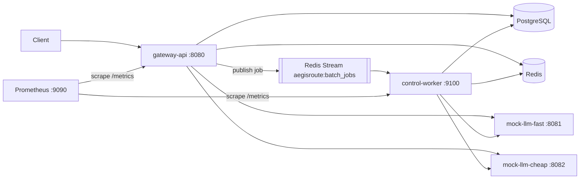

# AegisRoute — PROJECT_STATE

This file is the project's resumable memory. A new session resumes by reading
this file, `TODO.md`, `IMPLEMENTATION_LOG.md`, and `DECISIONS.md`, then running
`make verify`.

## Project goal

AegisRoute is a Go LLM inference gateway / control plane. It sits in front of
one or more OpenAI-compatible model backends and adds the boring-but-hard
backend concerns: auth, routing, retries, a circuit breaker, response caching,
idempotency, rate limiting, async batch processing, and metrics. Clients talk
to AegisRoute instead of talking to a model backend directly. **The value is
the control plane, not chatbot quality** — the model backends are deterministic
fakes on purpose.

## Architecture summary

`gateway-api` is the HTTP entry point (`:8080`): it authenticates requests,
routes inference to one of two `mock-llm` backends, and uses PostgreSQL for
durable state (API keys, backends, jobs) and Redis for cache / rate limits /
idempotency. Batch jobs are published to the Redis Stream
`aegisroute:batch_jobs` and consumed by `control-worker` (`:9100`), which
processes items with a bounded worker pool against the same backends and
stores. Prometheus scrapes `/metrics` on both processes.



**Exactly three binaries exist, forever:**

- `cmd/gateway-api` — the HTTP API server; `-migrate` runs DB migrations then
  exits, `-seed` inserts demo data then exits, default = serve.
- `cmd/control-worker` — reads batch jobs off a Redis Stream, bounded worker
  pool, own `/healthz` + `/metrics` port.
- `cmd/mock-llm` — fake OpenAI-compatible backend; two instances run in
  Compose ("fast" and "cheap").

## The 7 stages

1. **Foundations** (config, errors, logging, metrics scaffold) — ✅ **DONE** (`make verify` green)
2. **Data layer** (migrations, db, redisstore, models, repos) — ✅ **DONE**
3. **Gateway core** (server, middleware, auth, health/ready, seed, /v1/models) — ✅ **DONE**
4. **Sync inference** (mock-llm, inference client, routing, retry/timeout, circuit breaker, /v1/chat/completions) — ✅ **DONE**, committed (`c38a2a6` + polish `eed317c`)
5. **Cache + idempotency + rate limiting** — ✅ **DONE** (implemented + DoD green; **uncommitted** — see "Current state")
6. Batch jobs + Redis Streams + control-worker ← **NEXT**
7. Docker/Compose/Prometheus/E2E/README/docs/CI + final verification

## Current state (2026-07-06) — Stage 5 DONE, uncommitted

Stage 5 is fully implemented and the Definition of Done is green
(`gofmt -l .` empty; `go vet ./...`, `go build ./...`, `go test ./...` all
pass Docker-free, also under `-race`), **deliberately uncommitted** per
instruction. Commit with:

```
git commit -m "feat: response cache, idempotency, rate limiting on completion path"
```

What shipped:

- `internal/cache` — eligibility (stream:false + effective temperature ≤ 0.2,
  omitted → OpenAI default 1.0, explicit 0 cacheable), canonical body
  (sorted keys, array order preserved), key = sha256(tenant/key scope ‖
  canonical body), Redis entries (body + content type) with
  CACHE_TTL_SECONDS; miniredis tests.
- `internal/idempotency` — `Classify` (single semantics source),
  `IdempotencyStore` (Lookup/Begin/Complete), `Coordinator`
  (Check → rate limit → Begin → Complete), `Scope` (tenant+key+method+route,
  reused by Stage 6); in-memory-fake tests.
- `internal/db/idempotency_repo.go` — Postgres-authoritative store; atomic
  INSERT … ON CONFLICT … WHERE reclaim of expired/stale-pending rows (DB
  clock); integration subtest covers insert/conflict/reclaim/complete/expiry.
- `internal/ratelimit` — Redis fixed-window per API key; INCR+PEXPIRE in one
  Lua invocation (an orphaned counter without expiry is impossible);
  miniredis + FastForward tests. Fail-open on Redis errors.
- `internal/api` — chat handler reworked to the exact precedence (raw body
  read once → raw-bytes hash → validate → idempotency Check → rate limit →
  Begin → cache lookup → route/inference → cache store → ledger → Complete
  on every path); `X-AegisRoute-Cache: HIT|MISS|BYPASS`; rate-limit
  middleware on `GET /v1/models` (shared per-key budget, chat checks
  inline); replay never reuses a stored X-Request-ID. Ledger rows now carry
  `cache_result`; HIT rows have `backend_id` NULL.
- `cmd/gateway-api` wiring (idempotency lock TTL = 2× ServerWriteTimeout);
  `docs/design-decisions.md` (required precedence note + fail-open/closed
  stances).

Stage-5 tests: 14 handler-integration tests (miniredis + real
cache/limiter/coordinator over an in-memory store), plus package tests for
cache/idempotency/ratelimit and the db integration subtest.

**Post-Stage-5 verification pass (2 rounds) found and fixed 3 issues (all
uncommitted, DoD still green under -race):**

1. **CRITICAL — idempotency reclaim id (data-integrity):** the Postgres
   `Begin` used `ON CONFLICT DO UPDATE` which KEEPS the original PK id, but
   the in-memory fakes and the integration test assume a reclaim mints a
   FRESH id. Consequences: (a) the integration test would FAIL on real
   Postgres, and (b) a crashed/lapsed owner's `Complete(oldID)` could
   overwrite the reclaimer's in-flight record with a stale response. Fixed by
   adding `id = gen_random_uuid()` to the reclaim `SET`, so the old owner's
   `Complete`/`Release` safely no-op.
2. **CRITICAL — transient errors were cached under the idempotency key:** a
   5xx (e.g. a momentary all-backends-down 503) was stored and replayed for
   the whole TTL (24h default), so a client correctly reusing its
   Idempotency-Key on retry was locked out even after the gateway recovered.
   Fixed: added `Release` to the store/coordinator/gate; `respondChat` now
   Completes only `< 500` (success + deterministic 4xx) and Releases `>= 500`
   so the retry is a fresh attempt.
3. **Hardening — unbounded Idempotency-Key:** capped at 255 chars, rejected
   with 400 before any store interaction (it is part of a unique index).

Files touched by the fixes: internal/db/idempotency_repo.go,
internal/idempotency/idempotency.go (+ _test), internal/api/chat.go +
router.go (+ chat_stage5_test, helpers_test), internal/db/integration_test.go,
DECISIONS.md, docs/design-decisions.md.

## Stage 4 state (2026-07-05)

Stage 4 is fully implemented, committed as `c38a2a6` ("feat: mock-llm,
inference client, routing, circuit breaker, chat completions"), and the
Definition of Done is green (`gofmt -l .` empty; `go vet ./...`,
`go build ./...`, `go test ./...` all pass, Docker-free). That commit
includes an adversarial-review hardening pass folded in before commit:

- caller-context cancellation is classified as "canceled", never as a
  transient backend failure (circuit breaker + metrics no longer poisoned by
  client disconnects); `Breaker.ReportCanceled` returns a reserved half-open
  probe slot;
- chat validation is case-SENSITIVELY strict (stdlib JSON tag matching would
  otherwise have accepted `"MODEL"`/`"Stream"`/`"Role"` aliases);
- the inference_requests ledger insert runs on a context detached from the
  request's cancellation, so disconnects can't erase audit rows;
- `backoff()` honors a zero base.

A later session added AI-assistant context docs (no source changes):
`CLAUDE.md` (root), `docs/REPO_MAP.md`, `docs/STAGE_STATUS.md`,
`internal/db/CLAUDE.md`, `internal/routing/CLAUDE.md`,
`internal/jobs/CLAUDE.md` (the requested "queue" rules — there is no
`internal/queue` package; the `Queue` interface is documented to live in
`internal/jobs`, see that file's naming note).

**Uncommitted Stage-4 polish (this session — NOT committed, per instruction):**
six gateway-hardening items on top of `c38a2a6`, DoD green under `-race`
(254 test cases, up from 144). All are documented in DECISIONS.md's Stage-4
section; suggested commit message: `feat: intra-request failover, async
ledger, response cap, panic-safe circuit, timeout-budget validation`.

1. **Intra-request failover** — the handler now re-selects (excluding tried
   backends via `Selector.Select(ctx, model, exclude...)`) and calls the next
   healthy backend on a transient failure, instead of 503-ing until the
   circuit trips. Permanent errors/cancellations don't fail over.
2. **Async ledger** (`internal/api/ledger.go`, `AsyncLedger`) — the
   inference_requests write moved off the hot path onto a bounded worker pool
   fed by a buffered queue; wired in `cmd/gateway-api` and closed-before-pool
   on shutdown. `Deps.Requests` → `Deps.Ledger` (`LedgerRecorder`).
3. **Response size cap** — `inference.Config.MaxResponseBytes` (default 10 MiB
   via `io.LimitReader`); oversized reply → permanent error, no OOM.
4. **Panic-safe circuit report** — `callBackend` defers `release()` and a
   fallback `ReportCanceled`, so a panic can't strand a half-open probe.
5. **Timeout-budget validation** — `config.ServerWriteTimeout` (shared by the
   http.Server and `ValidateForServe`) + `config.InferenceBudget()`; the
   handler bounds all failover attempts by that budget.
6. **Permanent e2e wiring test** (`internal/api/e2e_test.go`) — real
   Selector+Client+Breaker vs httptest backends (happy path, intra-request
   failover, circuit-opens-and-sheds).

**Branch note:** work lives on `stage4_sync_inference_v2`, cut from
`stage3_gateway_core` (60fca48). The older `stage4_Sync_inference` branch was
mistakenly cut from the Stage-2 lineage and contains no Stage-3 code — do not
resume there; its tree is byte-identical to the Stage-2 commit inside
stage3's history, so it can be deleted.

## Scope table

| Bucket | Contents |
| --- | --- |
| **Current stage (build now)** | Stages 1–5 COMPLETE (Stage 5 uncommitted). Next session builds Stage 6 only: Queue interface (internal/jobs) + Redis Streams impl + in-memory fake, /api/v1/batch-jobs* endpoints, cmd/control-worker. Read internal/jobs/CLAUDE.md first. |
| **Future milestones (roadmap only)** | Stage 7. Do not create its source files, Docker assets, CI, scripts, or README sections early. Future-stage Makefile targets fail with `not implemented until Stage X`. |
| **Context only (never a build order)** | Architecture diagram, locked stack, ports table, demo credentials, Docker/compose notes, resume-positioning language. |
| **Non-goals (entire MVP; mention only in docs/future-work.md)** | k6, Grafana dashboards, Kubernetes, Terraform, real model providers, OIDC, RBAC, SSE/streaming, gRPC, sqlc, global/distributed concurrency control. |

## Locked stack

Go 1.25 (`go.mod` directive; toolchain may be newer). Module
`github.com/example/aegisroute`. chi/v5 (router), pgx/v5 + pgxpool (raw SQL, no
ORM), go-redis/v9, pressly/goose/v3 (embedded migrations), prometheus
client_golang, google/uuid, stretchr/testify, alicebob/miniredis/v2.
Hand-rolled `internal/config` (stdlib `os` only). `log/slog` JSON logging.
Full rationale in `DECISIONS.md`.

**Testing rule (every stage):** `go test ./...` passes with no Docker, no
Postgres, no Redis — interface-first design, in-memory fakes, miniredis.
Real-infra tests are `//go:build integration` only (`make test-integration`).

## Standard ports

```
gateway-api        :8080   (HTTP + /metrics)
control-worker     :9100   (/healthz + /metrics)
mock-llm-fast      :8081   (model: llama-fast, priority 10)
mock-llm-cheap     :8082   (model: llama-fast, priority 20)
postgres           :5432
redis              :6379
prometheus         :9090
```

## How to resume

1. Read `CLAUDE.md` (entry point), then this file, `TODO.md`,
   `IMPLEMENTATION_LOG.md`, `DECISIONS.md`. For structure, see
   `docs/REPO_MAP.md` and `docs/STAGE_STATUS.md`.
2. Run `make verify` (must be green before starting new work).
3. Work on the first unchecked stage in `TODO.md` — and only that stage.
   Check for a package-local `CLAUDE.md` (e.g. `internal/db/CLAUDE.md`)
   before touching that package.
4. Before stopping: update this file's stage status, tick `TODO.md`, append
   `IMPLEMENTATION_LOG.md`, and record any failing command + error verbatim.
