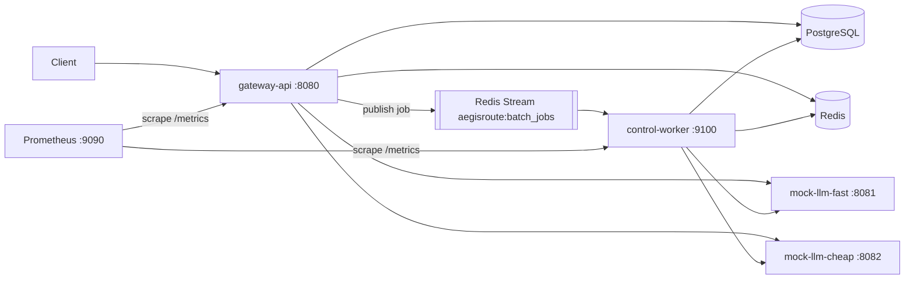

# AegisRoute

A Go **LLM inference gateway / control plane**. AegisRoute sits in front of one
or more OpenAI-compatible model backends and adds the boring-but-hard
operational concerns that every serious LLM deployment needs: authentication,
backend routing, retries, circuit breaking, response caching, request
idempotency, per-key rate limiting, an asynchronous batch path, an audit
ledger, and Prometheus metrics. Clients talk to AegisRoute instead of a model
backend directly.

The model backends here are **deterministic fakes** (`mock-llm`) on purpose:
the same request body always produces the same completion. That determinism is
what makes the control-plane behavior — cache hits, idempotent replays, batch
processing — observable in a demo. **The value is the control plane, not
chatbot quality.**

## What this is NOT

- **Not a chatbot.** There is no model, no prompt engineering, no RAG, no
  conversation state. The "completions" are hash-derived stubs. The interesting
  code is auth, routing, reliability, and the async pipeline — the parts you
  would actually operate in production.
- **Not a thin proxy.** A thin proxy forwards bytes. AegisRoute makes decisions:
  it selects a backend by policy (priority + weighted tie-break), enforces a
  per-process concurrency limit per backend, trips a circuit breaker on a
  failing backend and fails over to a healthy one *within a single request*,
  serves cache hits without touching a backend, deduplicates retried writes with
  an idempotency key, caps request rate per API key, and runs batch jobs through
  a durable at-least-once queue with a transactional outbox and a dead-letter
  queue. Every one of those is a deliberate, tested control-plane behavior.

## Architecture



**Exactly three binaries:**

- **`cmd/gateway-api`** — the HTTP API (`:8080`). Also runs migrations
  (`-migrate`) and seeding (`-seed`) as one-shot modes so they can never drift
  from the server. Serves `/v1/chat/completions`, `/v1/models`, the admin
  control plane, and the batch-jobs API.
- **`cmd/control-worker`** — consumes batch jobs off a Redis Stream with a
  bounded worker pool, processes each item against the same backends and stores
  the gateway uses (calling `internal/routing` + `internal/inference` directly,
  never back through the gateway over HTTP), and serves its own `/healthz` +
  `/metrics` on `:9100`.
- **`cmd/mock-llm`** — the deterministic fake backend. Compose runs two
  instances ("fast" and "cheap"), both serving the logical model `llama-fast`.

More detail: [docs/architecture.md](docs/architecture.md),
[docs/api.md](docs/api.md), [docs/design-decisions.md](docs/design-decisions.md).

## Quickstart

Requires Docker (with the Compose v2 plugin), plus `curl`, `jq`, and `go` for
the end-to-end check.

```sh
cp .env.example .env      # LOCAL-ONLY demo values, safe to use as-is
make dev-up               # build images + start the full stack (detached)
make verify-e2e           # bring up a clean stack, run every check, tear down
```

`make dev-up` leaves the stack running so you can poke at it with the curl
examples below. `make verify-e2e` is the automated gate: it starts from a clean
slate, runs the static + unit gate, brings the stack up, exercises the sync
cache path (MISS → HIT), the async batch path (create → terminal), and the
metrics endpoints, runs the integration suite against the live stores, and
tears everything down via a trap on exit. `make dev-down` stops a stack started
with `make dev-up`.

### Local credentials (LOCAL-ONLY)

These live in `.env.example` and are safe to commit — they are demo values and
are never valid outside a local dev stack:

| Purpose | Value |
| --- | --- |
| Tenant API key (bearer) | `sg_dev_key_123` |
| Admin token (`X-Admin-Token`) | `dev_admin_token` |

The API key is stored only as its `HMAC-SHA256` hash; the raw value never
touches the database.

## Demos (against a running `make dev-up` stack)

### 1. A chat completion

```sh
curl -sS -H "Authorization: Bearer sg_dev_key_123" \
  -H "Content-Type: application/json" \
  -d '{ "model": "llama-fast",
        "messages": [ {"role": "user", "content": "Return one short sentence about routing."} ],
        "temperature": 0, "max_tokens": 32 }' \
  http://localhost:8080/v1/chat/completions | jq
```

The response headers carry `X-AegisRoute-Backend` (which backend served it) and
`X-AegisRoute-Routing-Policy` (which policy chose it).

### 2. Cache HIT demo

An eligible request (`stream:false`, effective `temperature ≤ 0.2`) is cached on
the first 2xx. A second, semantically identical request — even with a *different*
`Idempotency-Key` — is a genuine cache hit that calls no backend. Watch the
`X-AegisRoute-Cache` header:

```sh
# First call: MISS (backend called, response cached)
curl -sS -D - -o /dev/null -H "Authorization: Bearer sg_dev_key_123" \
  -H "Idempotency-Key: demo-miss" -H "Content-Type: application/json" \
  -d '{"model":"llama-fast","temperature":0,"messages":[{"role":"user","content":"hi"}]}' \
  http://localhost:8080/v1/chat/completions | grep -i x-aegisroute-cache
# -> X-AegisRoute-Cache: MISS

# Second call: HIT (same canonical body, new key, no backend call)
curl -sS -D - -o /dev/null -H "Authorization: Bearer sg_dev_key_123" \
  -H "Idempotency-Key: demo-hit" -H "Content-Type: application/json" \
  -d '{"model":"llama-fast","temperature":0,"messages":[{"role":"user","content":"hi"}]}' \
  http://localhost:8080/v1/chat/completions | grep -i x-aegisroute-cache
# -> X-AegisRoute-Cache: HIT
```

Cache and idempotency are **independent mechanisms with independent keys**:
different `Idempotency-Key`s never block a real cache hit, and the same key
replays the exact prior response.

### 3. Batch job demo

Submit a batch, then poll it to a terminal status:

```sh
JOB_ID="$(curl -sS -H "Authorization: Bearer sg_dev_key_123" \
  -H "Content-Type: application/json" \
  -d '{ "requests": [
        { "custom_id": "batch-1", "body": { "model": "llama-fast",
          "messages": [{"role":"user","content":"Say batch one."}], "temperature": 0, "max_tokens": 32 } },
        { "custom_id": "batch-2", "body": { "model": "llama-fast",
          "messages": [{"role":"user","content":"Say batch two."}], "temperature": 0, "max_tokens": 32 } }
      ] }' \
  http://localhost:8080/api/v1/batch-jobs | jq -r .id)"

curl -sS -H "Authorization: Bearer sg_dev_key_123" \
  http://localhost:8080/api/v1/batch-jobs/$JOB_ID | jq '{id, status, total_items, completed_items, failed_items}'

curl -sS -H "Authorization: Bearer sg_dev_key_123" \
  http://localhost:8080/api/v1/batch-jobs/$JOB_ID/items | jq '.[] | {custom_id, status}'
```

The gateway persists the job, its items, and one outbox row in a single
Postgres transaction, then publishes one job-level message. The worker consumes
it, processes each item with a bounded pool, and acks the message only after the
durable Postgres updates — so redelivery is safe and idempotent.

### 4. Metrics demo

```sh
curl -sf http://localhost:8080/metrics | grep aegisroute_   # gateway
curl -sf http://localhost:9100/metrics | grep aegisroute_   # worker
open http://localhost:9090                                  # Prometheus UI
```

Both processes export the fixed `aegisroute_*` collector set; Prometheus scrapes
both. (Labeled counters appear only after their first increment — standard
Prometheus client behavior.)

## Developer Operations

### Makefile targets

| Target | What it does |
| --- | --- |
| `make help` | List all targets |
| `make verify` | The Docker-free gate: `gofmt -l .` clean, `go vet`, `go test` |
| `make fmt` / `make vet` / `make test` | The individual steps |
| `make dev-up` | Build images and start the full stack (detached) |
| `make dev-down` | Stop the stack, remove volumes and orphans |
| `make logs` | Follow logs from all compose services |
| `make verify-e2e` | Clean-slate end-to-end verification (the automated gate) |
| `make migrate-up` | Apply embedded migrations to `DATABASE_URL` (host run) |
| `make seed-dev` | Run the idempotent demo seeder (host run) |
| `make test-integration` | `//go:build integration` tests against real PG/Redis |
| `make clean` | Remove build/test artifacts (never source) |

### Environment

Config is environment-variables-only (stdlib `os`, no dotenv library);
empty-string values are treated as unset so defaults apply. Every variable is
documented in `.env.example`. Host-run Make targets source `.env` themselves;
Compose services get their env from the `environment:` blocks in
`docker-compose.yml` (which use **service names** like `postgres:5432`, while
`.env` uses `localhost` — the split is deliberate).

Config validation is split by run mode so a one-off operation never fails on an
unrelated variable: `ValidateForMigrate` (DB only), `ValidateForSeed` (DB +
key-hash secret + demo key + backend URLs), `ValidateForServe` (full gateway
runtime), and `ValidateForWorker` (stores + backend/retry/circuit + stream +
worker settings — deliberately *not* the gateway-only admin/cache/rate inputs
the worker never uses).

### Migration & seed flow

Migrations are embedded in the binary (`//go:embed`, goose) and are schema-only
— never secrets or seed rows. Seeding is a separate idempotent Go path
(`internal/seed`). For the demo, Compose sets `AEGISROUTE_AUTO_MIGRATE=true` and
`AEGISROUTE_AUTO_SEED=true` so the gateway migrates and seeds on boot. A real
deployment would instead run `-migrate` as a discrete deploy step with
auto-migrate off (goose's advisory lock makes concurrent runs safe, but
deliberate is better than N replicas racing on boot).

### Compose services & where things live

| Service | Port(s) | Notes |
| --- | --- | --- |
| `gateway-api` | 8080 | HTTP API + `/metrics`; auto-migrate + auto-seed on boot |
| `control-worker` | 9100 | Batch consumer; `/healthz` + `/metrics` |
| `mock-llm-fast` | 8081 | Backend, priority 10 |
| `mock-llm-cheap` | 8082 | Backend, priority 20 |
| `postgres` | 5432 | Durable state; named volume `pgdata` |
| `redis` | 6379 | Cache, rate limit, idempotency lock, batch stream |
| `prometheus` | 9090 | Scrapes both processes' `/metrics` |

Logs: `make logs` (or `docker compose logs -f <service>`). Metrics: the
`/metrics` endpoints above and the Prometheus UI at `:9090`.

### Troubleshooting

- **`make verify-e2e` fails at readiness wait** — the gateway couldn't reach
  Postgres/Redis in ~60s. Check `docker compose logs postgres redis gateway-api`.
- **Batch job never reaches terminal** — check the worker: `docker compose logs
  control-worker`. It must be able to reach Postgres, Redis, and the backends.
- **`config` errors at boot** — a required variable is missing/malformed; the
  error names the variable (never its value). Compare against `.env.example`.
- **Image build fails on the Go base tag** — the Dockerfiles pin a specific
  `golang:1.25.x` patch; bump it to a patch available in your registry.

## Assumptions & Tradeoffs

- `go.mod` declares `go 1.25`; the local toolchain may be newer — the directive,
  not the installed toolchain, is the compatibility contract.
- Module path is `github.com/example/aegisroute` until published; rename with
  `go mod edit -module github.com/<you>/aegisroute && go mod tidy`.
- `go test ./...` requires **no** Docker, Postgres, or Redis — ever. Real-infra
  tests are gated behind `//go:build integration` and run via
  `make test-integration` or `make verify-e2e`.
- `max_in_flight` (per-backend concurrency) and the circuit breaker are
  **per-process**, not distributed: N gateway/worker replicas each enforce them
  independently. Distributed/global concurrency control is an explicit non-goal.
- Idempotency is **Postgres-authoritative**; only definitive outcomes (`< 500`)
  are stored and replayed. A retryable `5xx` releases the record so a same-key
  retry is a fresh attempt (the Stripe stance).
- Batch delivery is **at-least-once**; correctness comes from idempotent worker
  processing keyed on Postgres item state (terminal items are never re-claimed),
  not from exactly-once delivery.
- The mock backends are deterministic by design; swapping in real
  OpenAI-compatible providers is future work (`docs/future-work.md`).
- `internal/metrics.New()` registers only the `aegisroute_*` collectors into a
  fresh registry (no Go runtime/process collectors), keeping `/metrics` small
  and deterministic for tests.

## Key failure modes

Full matrix: [docs/failure-modes.md](docs/failure-modes.md). Highlights:

- **A backend is down** → transient errors trip its circuit breaker; the request
  fails over to a healthy backend within the same request, bounded by the
  inference budget (server write deadline − margin).
- **Redis is down** → cache and rate limiting **fail open** (degrade the
  feature, never availability); idempotency **fails closed** with a 500 (guessing
  about replay correctness would break the exactly-once promise).
- **A worker crashes mid-item** → the message is never acked; a stranded
  `running` item is requeued on redelivery, and stream reclaim (`XAUTOCLAIM`)
  recovers messages left by a dead consumer.
- **An item keeps failing** → after `WORKER_MAX_ITEM_ATTEMPTS` it is failed
  terminally and dead-lettered (`:dlq` stream), and the batch keeps going.
- **The API's publish fails after commit** → the job is not lost: its outbox row
  stays pending and the worker's outbox-drain loop republishes it.

## Resume / handoff bullets

See [docs/resume-bullets.md](docs/resume-bullets.md) for a concise,
interview-ready description of what was built and why.
