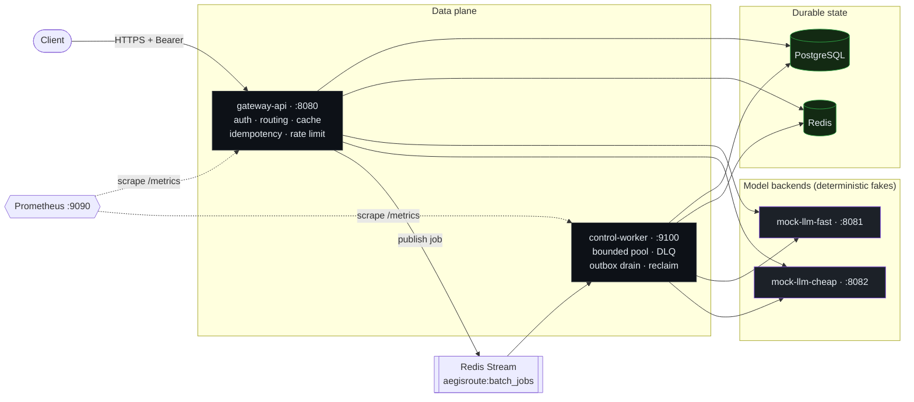

<div align="center">

# 🛡️ AegisRoute

### The control plane your LLM backends are missing.

A production-grade **LLM inference gateway** written in Go. It sits in front of your
OpenAI-compatible model backends and owns the boring-but-hard operational layer:
**auth · policy routing · circuit breaking · response caching · idempotency · rate
limiting · a durable batch pipeline · full Prometheus observability.**

**Not a chatbot. Not a thin proxy. The hard part.**

<br />


[](https://github.com/s2yao/AegisRoute/actions/workflows/ci.yml)


[**Quickstart**](#-quickstart) · [**Interactive demo**](#-interactive-demo--play-with-it) · [**Architecture**](#-architecture) · [**Benchmarks**](#-benchmarks) · [**Demos**](#-demos) · [**Docs**](docs/)

</div>

---

> This isn't an LLM speed benchmark — the model is a deterministic mock, so raw
> latency numbers aren't the point. What's proven **live, end-to-end**, via
> `make verify-e2e`: the **cache actually skips the backend on a hit**, the
> **circuit breaker reroutes every request** when a backend is forced to fail
> (**200/200 succeeded**), the **rate limiter enforces its window**
> (**45/50 rejected** at a 5 QPS cap), and the **batch pipeline delivers
> at-least-once** through a transactional outbox and DLQ. **15** Prometheus
> metrics and **~280 tests** (zero Docker) back every one of those with a
> number, not a guess.
>
> <sub>There are also latency/throughput ratios (`make bench`) — see why they're
> mostly config arithmetic, not an optimization claim, in [Benchmarks](#-benchmarks) below.</sub>

---

## 🎯 What it is (and what it is deliberately NOT)

AegisRoute is the layer between your clients and your models. Clients talk to
AegisRoute instead of a model backend directly, and AegisRoute makes every
operational decision a serious LLM deployment needs — then proves it did, in
metrics.

The model backends here are **deterministic fakes** (`mock-llm`) *on purpose*:
the same request body always yields the same completion. That determinism is
exactly what makes control-plane behavior — cache hits, idempotent replays, batch
fan-out, failover — **observable in a live demo**. The value is the control plane,
not chatbot quality.

| ❌ What it is **not** | ✅ What it actually does |
| --- | --- |
| **Not a chatbot** — no model, no prompts, no RAG, no conversation state. | Selects a backend by **policy** (priority + weighted tie-break), per request. |
| **Not a thin proxy** — a thin proxy forwards bytes. | Enforces **per-backend concurrency**, trips a **circuit breaker**, and **fails over to a healthy backend inside a single request**. |
| Not "just add a cache." | Serves **cache hits without touching a backend**, and **deduplicates retried writes** with an idempotency key — two independent mechanisms, two independent keys. |
| Not fire-and-forget batching. | Runs batches through a **durable at-least-once queue** with a **transactional outbox** and a **dead-letter queue**. |

---

## 🏗️ Architecture

Three small binaries, one Postgres, one Redis, two interchangeable model
backends, and Prometheus watching all of it.



**Exactly three binaries — forever:**

| Binary | Role | Ports |
| --- | --- | --- |
| **`gateway-api`** | The HTTP API. Also runs schema migrations (`-migrate`) and idempotent seeding (`-seed`) as one-shot modes, so ops and server can never drift. Serves chat completions, `/v1/models`, the admin control plane, and the batch API. | `:8080` |
| **`control-worker`** | Consumes batch jobs off a Redis Stream with a **bounded worker pool**, processing each item against the *same* routing + inference code the gateway uses — calling it **directly, never back over HTTP**. Owns `/healthz` + `/metrics`. | `:9100` |
| **`mock-llm`** | The deterministic fake backend (content = hash of the request body). Compose runs two instances, "fast" and "cheap", both serving the logical model `llama-fast`. | `:8081` / `:8082` |

📎 Deeper dives: [docs/architecture.md](docs/architecture.md) · [docs/api.md](docs/api.md) · [docs/design-decisions.md](docs/design-decisions.md)

---

## 🔬 The request pipeline

The completion path is a **load-bearing, test-pinned precedence order**. Reordering
it breaks idempotency, rate-limit, or cache correctness — so the order is an
enforced invariant, not an accident:

```
POST /v1/chat/completions
   │
   ▼
 bearer auth ─▶ read raw body once (1 MiB cap) ─▶ hash raw bytes
   │
   ▼
 strict validate ─▶ idempotency CHECK ─▶ rate limit ─▶ idempotency BEGIN
   │                (replay / conflict)   (new work only)   (pending record)
   ▼
 cache lookup ──HIT──▶ return cached body (no backend call)   ⟵ X-AegisRoute-Cache: HIT
   │ MISS
   ▼
 Selector.Select ─▶ inference.Client.Do ─▶ mock-llm ─▶ circuit-breaker report
   │  (policy, semaphore, breaker)  (timeout, retry, failover)
   ▼
 cache store (2xx + eligible) ─▶ async audit ledger ─▶ idempotency RESOLVE
                                                        (<500 Complete · ≥500 Release)
```

- **Cache & idempotency are separate mechanisms with separate keys.** A different
  `Idempotency-Key` never blocks a genuine cache hit for the same body.
- **Only definitive outcomes are stored.** `<500` → `Complete` (a same-key retry
  replays it); retryable `5xx` → `Release` (the retry is a fresh attempt). The
  Stripe stance — never cache a transient failure.

---

## 📊 Benchmarks

Reproduce with a single command: `make bench`. Local Docker Compose, `hey` at
`c=50`, a simulated 40ms backend, cache on. These measure the **control plane**,
not model inference — and two of the numbers below need a caveat *before* you
read them, not after.

> **Read the latency ratio skeptically.** The "backend call" is a 40ms sleep
> (`MOCK_LATENCY_MS=40`) standing in for a model. Skipping a fixed sleep via
> cache will *always* look like a huge win, and the exact multiple is just
> `sleep duration ÷ Redis lookup time` — it moves if I change one env var, not
> if I ship better engineering. Same story for batch throughput: it's
> downstream of that same constant plus `WORKER_CONCURRENCY`, not a
> batching-algorithm result. Treat both as "the pipe is not the bottleneck,"
> not as a portable performance claim.
>
> The rows that *are* a real result: **circuit breaker** and **rate limit**
> are pass/fail correctness proofs — did the mechanism fire under an injected
> fault, yes or no — not latency arithmetic.

<div align="center">

| Profile | p50 | **p95** | p99 | Throughput |
| --- | :---: | :---: | :---: | :---: |
| Uncached — full path (BYPASS) | 44.7 ms | **48.4 ms** | 54.0 ms | ~1,111 req/s |
| **Cached (HIT)** | 3.7 ms | **8.3 ms** | 13.9 ms | **~11,580 req/s** |
| **Δ** | | **↓ 5.8×** | | **↑ 10.4×** |

<sub>↑ config arithmetic, not an optimization result — see caveat above</sub>

</div>

- 🔌 **Circuit breaker: 200/200 requests still succeeded** with the primary backend
  *forced to fail* — the breaker opened after 5 consecutive transient failures,
  short-circuited ~180 later calls, and every request failed over to the healthy
  peer. **This is the number worth trusting.**
- 🚦 **Rate limit: 45/50 rapid requests correctly rejected with `429`** at a 5 QPS
  per-key window, all counted in `aegisroute_rate_limited_total`. **Also worth trusting.**
- 🎯 Cache hit ratio: 0.9999 (from Prometheus) — confirms the cache mechanism fires
  reliably, not that 0.9999 is a target you should expect in production.
- 🧵 Batch: 200 items (2 chunks of ≤100) reached `succeeded` in ~2s through the
  bounded worker pool — proves the outbox → stream → worker → terminal-write
  path is wired correctly end-to-end; the ~6,000 items/min figure is the same
  config arithmetic as the latency ratio above.

Every number is **also readable straight from Prometheus** (fine-bucketed
histograms, a cache-labeled completion histogram, reliability counters) — the
claims are instrumented, not asserted. Full method: [docs/benchmarks.md](docs/benchmarks.md).

---

## ✨ Feature tour

<table>
<tr>
<td width="50%" valign="top">

### 🔐 Auth & tenancy
- Bearer API keys stored **only** as `HMAC-SHA256` — a leaked DB row reveals no usable credential.
- Admin token compared in **constant time**; an empty configured token authorizes nobody.
- Credentials in query params → **rejected `400`** before auth (they leak into logs/proxies).
- Every request scoped to a tenant; every response carries `X-Request-ID`.

</td>
<td width="50%" valign="top">

### 🧭 Routing & reliability
- **Policy-based selection**: priority ordering + weighted tie-break.
- **Per-process `max_in_flight` semaphore** per backend.
- **Circuit breaker** — closed → open → half-open, single probe; caller-cancellation is verdict-free.
- **In-request failover** across backends, bounded by the write deadline.

</td>
</tr>
<tr>
<td width="50%" valign="top">

### ⚡ Cache & idempotency
- Response cache keyed on `sha256(scope ‖ canonical body)`; eligibility = `stream:false` **and** effective temp ≤ 0.2.
- **Postgres-authoritative idempotency** with a single atomic `INSERT … ON CONFLICT … WHERE` reclaim on the DB clock.
- A reclaim **mints a fresh record id**, so a crashed owner can't overwrite the reclaimer.

</td>
<td width="50%" valign="top">

### 🧵 Durable batch pipeline
- **Transactional outbox**: job + items + outbox row in one Postgres tx, then one job-level publish.
- **Redis Streams** consumer group — `XREADGROUP`, `XACK`, `XAUTOCLAIM`, `MAXLEN ~` trim.
- **Bounded worker pool**, atomic item claims (`FOR UPDATE SKIP LOCKED`), **DLQ** on exhaustion.
- **Ack only after the durable write** — at-least-once, idempotent per item.

</td>
</tr>
</table>

### 🚦 Fail-open vs fail-closed — a deliberate choice per mechanism

| Dependency down | Cache | Rate limit | Idempotency |
| --- | --- | --- | --- |
| **Redis unreachable** | **fail open** (serve, skip cache) | **fail open** (serve, skip limit) | **fail closed** `500` |

> Availability-first where a wrong answer is harmless (cache/limit); correctness-first
> where guessing would break an exactly-once promise (idempotency).

---

## 🚀 Quickstart

Requires Docker (with the Compose v2 plugin), plus `curl`, `jq`, and `go` for the
end-to-end check.

```sh
cp .env.example .env      # LOCAL-ONLY demo values, safe to use as-is
make dev-up               # build images + start the full stack (detached)
make verify-e2e           # clean-slate: run every check end-to-end, then tear down
```

`make dev-up` leaves the stack running so you can poke at it with the demos below.
`make verify-e2e` is the automated gate — it starts clean, runs the static + unit
gate, brings the stack up, proves the sync cache path (**MISS → HIT**), the async
batch path (**create → terminal**), and the metrics endpoints, runs the integration
suite against the live stores, and tears everything down via an exit trap.

## 🎮 Interactive demo — play with it


Don't just read the feature list — break the thing and watch it cope:

```sh
make demo
```

One command brings up the demo stack (realistic ~40ms mock-inference latency,
plus **Grafana** and a **browser demo console**) and drops you into a scenario
menu. Five scripted scenarios fire real concurrent traffic and report exactly
what the control plane did — status distributions, cache headers, and metric
deltas read straight from `/metrics`:

| Scenario | The moment |
| --- | --- |
| `cache-storm` | 200 identical requests → first wave pays ~40ms, the rest are ~1ms Redis HITs |
| `idempotency-replay` | 10 requests race one `Idempotency-Key` → 1 executes, 9 get 409; 20 replays later, backend calls **+0** |
| `rate-limit-burst` | 50 requests into a 10 QPS window → watch the 429s |
| `backend-outage` | **kills the primary backend container** mid-traffic → breaker opens, every request still 200s via failover, then recovers |
| `batch-flood` | 200 async items through the outbox → Redis Stream → bounded worker pool |

While they run, watch it live:

| URL | What |
| --- | --- |
| http://localhost:3000 | **Grafana** — auto-provisioned dashboard over all 15 metrics, no login |
| http://localhost:8000 | **Demo console** — fire scenarios from the browser; live breaker/cache/throughput tiles |

The console's party trick: turn on *Live traffic*, run
`docker compose stop mock-llm-fast` in a terminal, and watch the breaker tile
flip to OPEN while the success counter keeps climbing. Full guide:
[docs/demo.md](docs/demo.md).

---

### 🔑 Local credentials (LOCAL-ONLY)

These live in `.env.example`, are demo-only, and are never valid outside a local
stack. The API key is stored only as its `HMAC-SHA256` hash — the raw value never
touches the database.

| Purpose | Value |
| --- | --- |
| Tenant API key (bearer) | `sg_dev_key_123` |
| Admin token (`X-Admin-Token`) | `dev_admin_token` |

---

## 🎬 Demos

<sub>Against a running `make dev-up` stack.</sub>

### 1. A chat completion

```sh
curl -sS -H "Authorization: Bearer sg_dev_key_123" \
  -H "Content-Type: application/json" \
  -d '{ "model": "llama-fast",
        "messages": [ {"role": "user", "content": "Return one short sentence about routing."} ],
        "temperature": 0, "max_tokens": 32 }' \
  http://localhost:8080/v1/chat/completions | jq
```

Response headers carry `X-AegisRoute-Backend` (who served it) and
`X-AegisRoute-Routing-Policy` (which policy chose it).

### 2. Cache HIT — watch a backend get skipped

An eligible request is cached on the first 2xx. A second, semantically identical
request — even with a **different** `Idempotency-Key` — is a genuine cache hit that
calls no backend:

```sh
# First call: MISS (backend called, response cached)
curl -sS -D - -o /dev/null -H "Authorization: Bearer sg_dev_key_123" \
  -H "Idempotency-Key: demo-miss" -H "Content-Type: application/json" \
  -d '{"model":"llama-fast","temperature":0,"messages":[{"role":"user","content":"hi"}]}' \
  http://localhost:8080/v1/chat/completions | grep -i x-aegisroute-cache
# -> X-AegisRoute-Cache: MISS

# Second call: HIT (same canonical body, new key, no backend call)
curl -sS -D - -o /dev/null -H "Authorization: Bearer sg_dev_key_123" \
  -H "Idempotency-Key: demo-hit" -H "Content-Type: application/json" \
  -d '{"model":"llama-fast","temperature":0,"messages":[{"role":"user","content":"hi"}]}' \
  http://localhost:8080/v1/chat/completions | grep -i x-aegisroute-cache
# -> X-AegisRoute-Cache: HIT
```

### 3. A batch job — submit, then poll to terminal

```sh
JOB_ID="$(curl -sS -H "Authorization: Bearer sg_dev_key_123" \
  -H "Content-Type: application/json" \
  -d '{ "requests": [
        { "custom_id": "batch-1", "body": { "model": "llama-fast",
          "messages": [{"role":"user","content":"Say batch one."}], "temperature": 0, "max_tokens": 32 } },
        { "custom_id": "batch-2", "body": { "model": "llama-fast",
          "messages": [{"role":"user","content":"Say batch two."}], "temperature": 0, "max_tokens": 32 } }
      ] }' \
  http://localhost:8080/api/v1/batch-jobs | jq -r .id)"

curl -sS -H "Authorization: Bearer sg_dev_key_123" \
  http://localhost:8080/api/v1/batch-jobs/$JOB_ID | jq '{id, status, total_items, completed_items, failed_items}'
```

The gateway persists the job, its items, and one outbox row in a **single Postgres
transaction**, then publishes one job-level message. The worker consumes it,
processes each item with a bounded pool, and acks **only after** the durable
updates — so redelivery is safe and idempotent.

### 4. Metrics

```sh
curl -sf http://localhost:8080/metrics | grep aegisroute_   # gateway
curl -sf http://localhost:9100/metrics | grep aegisroute_   # worker
open http://localhost:9090                                  # Prometheus UI
```

---

## 📈 Observability — the 15-metric `aegisroute_*` set

One non-global registry per process (no accidental double-registration, small
deterministic `/metrics`). Latency histograms use **fine buckets** tuned for a
sub-millisecond-cache gateway, so p95/p99 read accurately.

| Metric | Type · labels | What it tells you |
| --- | --- | --- |
| `aegisroute_http_requests_total` | counter · `route,method,status` | Traffic + error rate per endpoint |
| `aegisroute_http_request_duration_seconds` | histogram · `route,method` | End-to-end latency |
| `aegisroute_chat_completion_duration_seconds` | histogram · `cache` | **HIT vs BYPASS latency, straight from metrics** |
| `aegisroute_backend_requests_total` | counter · `backend,outcome` | Per-backend success/transient/permanent/canceled |
| `aegisroute_backend_request_duration_seconds` | histogram · `backend` | Upstream latency per backend |
| `aegisroute_backend_retries_total` | counter · `backend` | Retry pressure |
| `aegisroute_backend_in_flight` | gauge · `backend` | Live concurrency vs `max_in_flight` |
| `aegisroute_circuit_breaker_state` | gauge · `backend` | 0 closed · 1 half-open · 2 open |
| `aegisroute_circuit_breaker_transitions_total` | counter · `backend,to` | Every breaker flip |
| `aegisroute_circuit_breaker_short_circuits_total` | counter · `backend` | Calls skipped past an open circuit |
| `aegisroute_cache_events_total` | counter · `result` | hit / miss / bypass |
| `aegisroute_rate_limited_total` | counter | `429`s issued |
| `aegisroute_batch_jobs_created_total` | counter | Batch intake |
| `aegisroute_batch_items_processed_total` | counter · `outcome` | Worker throughput + failures |
| `aegisroute_worker_failures_total` | counter | Worker-level (not per-item) failures |

Plus structured `slog` JSON logs behind a **single redaction gate** (never bodies,
never secrets) and an `X-Request-ID` on every response.

---

## 🧯 Failure modes

Full matrix in [docs/failure-modes.md](docs/failure-modes.md). Highlights:

| Failure | What happens |
| --- | --- |
| **A backend is down** | Transient errors trip its breaker; the request **fails over** to a healthy backend within its own deadline. |
| **Redis is down** | Cache + rate limiting **fail open**; idempotency **fails closed** with `500`. |
| **A worker crashes mid-item** | The message is never acked; a stranded `running` item is requeued, and `XAUTOCLAIM` recovers messages from the dead consumer. |
| **An item keeps failing** | After `WORKER_MAX_ITEM_ATTEMPTS` it's failed terminally and **dead-lettered**; the batch keeps going. |
| **Publish fails after commit** | The job isn't lost — its **outbox row stays pending** and the worker's drain loop republishes it. |

---

## 🧪 Testing philosophy

<div align="center">

| ~8.4k | ~7k | 214 | 16 | 15 | 0 |
| :---: | :---: | :---: | :---: | :---: | :---: |
| lines of **production Go** | lines of **tests** | **test/benchmark funcs** | internal packages | metrics | **Docker needed for `go test`** |

</div>

- **`go test ./...` passes with no Docker, no Postgres, no Redis — forever.**
  Interface-first design: consumers declare their own repository interfaces, fed by
  in-memory fakes. The Redis-Streams adapter is unit-tested against **miniredis**.
- **Pure logic is tested as pure logic** — the circuit breaker, routing selection,
  cache-key canonicalization, validation, key hashing, and the batch status machine
  are state machines tested directly, no mocks.
- **Real-infra tests are `//go:build integration` only** (`make test-integration`).
- The whole suite is **race-clean** (`go test -race ./...`).

---

## 🛠️ Developer operations

| Target | What it does |
| --- | --- |
| `make help` | List all targets |
| `make verify` | **The gate**: `gofmt -l .` clean → `go vet` → `go test` (no Docker) |
| `make dev-up` / `make dev-down` | Start / stop the full Compose stack |
| `make demo` / `make demo-down` | Interactive demo: stack + Grafana + console + scenario menu |
| `make demo-gif` | Re-record `docs/assets/demo.gif` with vhs against the live demo stack |
| `make logs` | Follow logs from all services |
| `make verify-e2e` | Clean-slate end-to-end verification (up → assert → tear down) |
| `make bench` | Reproduce the benchmark numbers above |
| `make migrate-up` / `make seed-dev` | Apply migrations / run the idempotent seeder (host) |
| `make test-integration` | `//go:build integration` tests against real PG/Redis |

**Config** is environment-variables-only (stdlib `os`, no dotenv library); every
variable is documented in `.env.example`. Validation is split by run mode
(`ValidateForMigrate` / `ForSeed` / `ForServe` / `ForWorker`) so a one-off op never
fails on a variable it doesn't use.

**Migrations** are embedded in the binary (`//go:embed` + goose) and **schema-only**
— never secrets or seed rows. Seeding is a separate idempotent Go path. Compose
enables auto-migrate + auto-seed for the demo; a real deployment runs `-migrate` as
a discrete step.

---

## ⚖️ Assumptions & tradeoffs

- `go.mod` declares `go 1.25.7`; the Docker build pins `golang:1.25.11` (a patch ≥
  the directive), so the image builds without downloading a newer toolchain.
- Module path is `github.com/example/aegisroute` until published — rename with
  `go mod edit -module github.com/<you>/aegisroute && go mod tidy`.
- `max_in_flight` and the circuit breaker are **per-process, not distributed**: N
  replicas each enforce them independently. Global concurrency control is an
  explicit non-goal (and the top item on the roadmap).
- Batch delivery is **at-least-once**; correctness comes from idempotent,
  Postgres-keyed worker processing, not exactly-once delivery.
- The mock backends are deterministic by design; swapping in real
  OpenAI-compatible providers behind the same `inference.Client` is future work.

---

## 🗺️ Roadmap

See [docs/future-work.md](docs/future-work.md). The headliners:

- **Distributed concurrency control** — make `max_in_flight` and the breaker global
  rather than per-process (the big one).
- Real OpenAI-compatible providers behind the existing `inference.Client`.
- **SSE / streaming** completions.
- **OIDC + RBAC** for the admin plane.
- Consumer-group **lag metrics** for the batch stream.

---

## 📚 Documentation index

| Doc | What's in it |
| --- | --- |
| [docs/demo.md](docs/demo.md) | The interactive demo: scenarios, Grafana, console, hosting notes |
| [docs/architecture.md](docs/architecture.md) | System design, dataflows, component boundaries |
| [docs/api.md](docs/api.md) | Endpoint reference, request/response shapes, error envelope |
| [docs/design-decisions.md](docs/design-decisions.md) | The authoritative chat-request precedence + rationale |
| [docs/failure-modes.md](docs/failure-modes.md) | Full failure matrix |
| [docs/benchmarks.md](docs/benchmarks.md) | Benchmark method, numbers, and honest caveats |
| [docs/resume-bullets.md](docs/resume-bullets.md) | Interview-ready summary of what was built and why |

---

<div align="center">
<sub>Built in Go. Tested without Docker. Instrumented end to end.</sub>
</div>
