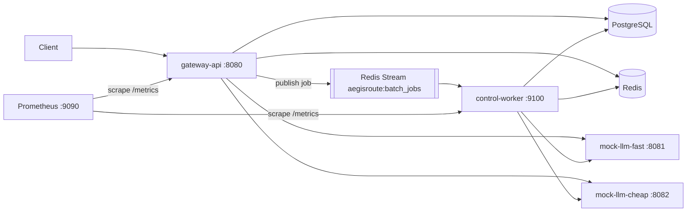

# Architecture

AegisRoute is a Go LLM inference gateway / control plane split into three
binaries over PostgreSQL (durable state) and Redis (cache, rate-limit,
idempotency lock, and the batch stream). This document describes the components
and the two load-bearing dataflows. For the exact request precedence and its
rationale see [design-decisions.md](design-decisions.md); for the failure matrix
see [failure-modes.md](failure-modes.md).

## System diagram

## Binaries

- **`cmd/gateway-api` (`:8080`)** — the HTTP control plane. Three modes by flag:
  `-migrate` applies embedded migrations and exits; `-seed` runs the idempotent
  demo seeder and exits; no flag serves the API with graceful shutdown. One
  artifact with three modes means migrations/seeding can never drift from the
  server.
- **`cmd/control-worker` (`:9100`)** — the asynchronous half. Consumes job-level
  messages from the Redis Stream with a bounded pool, processes items against
  the same backends and stores as the gateway, and exposes `/healthz` +
  `/metrics`. It calls `internal/routing` + `internal/inference` **directly** —
  never back through gateway-api over HTTP.
- **`cmd/mock-llm`** — a deterministic OpenAI-compatible backend (content
  derived from a SHA-256 of the request body; fixed `created`). Two instances
  run in Compose ("fast" priority 10, "cheap" priority 20), both serving the
  logical model `llama-fast`. Env knobs (`MOCK_LATENCY_MS`, `MOCK_JITTER_MS`,
  `MOCK_FAILURE_RATE`) inject latency and failures to exercise retry/circuit
  paths.

## Packages (by role)

- **HTTP edge** — `internal/api` (chi router, middleware chain, handlers,
  consumer-declared interfaces), `internal/auth` (bearer HMAC + admin token),
  `internal/httperror` (the one error envelope).
- **Reliability core** — `internal/routing` (`Selector` backend choice +
  per-process `max_in_flight` semaphores + `Breaker` circuit state machine),
  `internal/inference` (`Client.Do` with per-attempt timeout, transient-only
  retry, full-jitter backoff, response cap).
- **Request-path controls** — `internal/cache` (eligibility, canonical body,
  keying, Redis get/put), `internal/idempotency` (`Classify` semantics,
  `Coordinator`, `Scope`), `internal/ratelimit` (Redis fixed-window Lua).
- **Async path** — `internal/jobs` (pure status machines + `JobStore` contract +
  in-memory fake), `internal/redisstore` (shared Redis client + the `Queue`
  interface with a Redis-Streams adapter and an in-memory fake),
  `internal/worker` (the bounded consumer).
- **Data** — `internal/db` (pgx pool, embedded goose migrations, repositories
  incl. `JobRepo`), `internal/models` (domain structs + typed enums).
- **Cross-cutting** — `internal/config` (env config + per-mode validators),
  `internal/metrics` (one non-global registry, the fixed `aegisroute_*` set),
  `internal/observability` (slog JSON, request-id context, redaction),
  `internal/seed` (idempotent demo data).

## Dataflow 1 — synchronous chat completion

`POST /v1/chat/completions` (the precedence is load-bearing and pinned by
tests — see [design-decisions.md](design-decisions.md)):

1. Middleware: recover → request-id → logging → metrics → reject query
   credentials.
2. Bearer auth resolves the API key to a `Principal{TenantID, APIKeyID}`.
3. Read the raw body once (1 MiB cap); hash the exact bytes for idempotency.
4. Parse + validate strictly (case-sensitive keys; `stream:true` → 400).
5. Idempotency **Check** — a completed same-key request replays here, for free.
6. Rate limit — only genuinely new work is charged.
7. Idempotency **Begin** — open the pending record.
8. Cache lookup — a HIT responds without any backend call.
9. `Selector.Select` → `inference.Client.Do` → mock-llm, with intra-request
   failover across backends on transient errors, bounded by the inference
   budget; the `Breaker` sees every outcome.
10. Cache store (2xx + eligible), async audit ledger row, idempotency resolve
    (`Complete` for `< 500`, `Release` for `>= 500`).

## Dataflow 2 — asynchronous batch job

`POST /api/v1/batch-jobs` and the worker:

1. Validate (same chat validation per item; 1..100 items; unique `custom_id`;
   one shared model), then in **one Postgres transaction** persist the job
   (`queued`), one item per request (`queued`), and one `batch_job_outbox` row.
2. After commit, publish **one** job-level message (the job id) to the stream.
   If the publish succeeds, mark the outbox row published; if it fails, leave it
   pending — the worker's outbox-drain loop republishes it, so a job is never
   orphaned.
3. The worker consumes the message, marks the job `running`, and processes items
   with a **bounded pool** (`WORKER_CONCURRENCY`). Each goroutine atomically
   claims the next queued item (`FOR UPDATE SKIP LOCKED`), runs it through
   routing + inference, and writes the terminal result durably.
4. After every item is terminal, it recomputes the job status
   (all-succeeded / mixed / all-failed) and **only then acks** the message.
   Delivery is at-least-once; because terminal items are never re-claimable,
   redelivery is a safe no-op. Stream reclaim (`XAUTOCLAIM`) recovers messages
   stranded by a crashed consumer; an item exceeding `WORKER_MAX_ITEM_ATTEMPTS`
   is dead-lettered to the `:dlq` stream.

## Key invariants

- `go test ./...` is Docker-free forever; real-infra tests are
  `//go:build integration`.
- Exactly three binaries.
- Request precedence on the chat path is fixed and tested.
- Idempotency is Postgres-authoritative; a reclaim mints a fresh record id so a
  lapsed owner cannot overwrite a reclaimer.
- `max_in_flight` and the circuit breaker are per-process (not distributed).
- The worker never calls gateway-api over HTTP; it shares the inference/routing
  packages in-process.
- Metric names are the fixed `aegisroute_*` set on one non-global registry.
